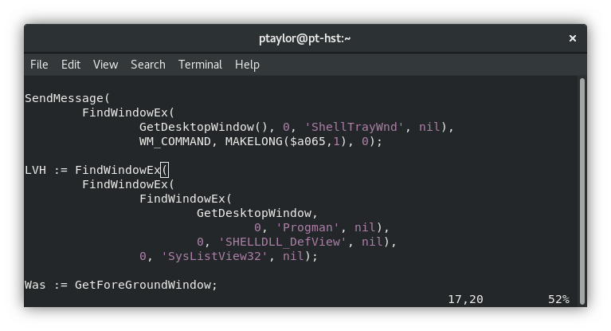
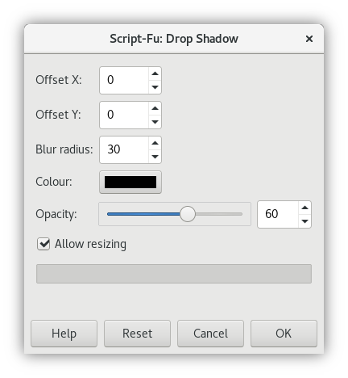

# smooth-drop-shadow
Copies images, adding a smooth drop shadow, with enlargement to accommodate. Requires GIMP.

## Demo
The following image has the drop shadow applied as an example.

## Settings
The settings can easily be tweaked by editing the script. The default settings provided in the script are the equivalent of the Gimp GUI settings shown below. Of course, the below image also has the drop shadow applied as a further example!

## Roadmap
- [ ] Source code optimisation
- [ ] Ability to specify optional command line arguments to adjust settings

## License
Copyright (c) 2018 Paul Taylor

See LICENSE file for details

